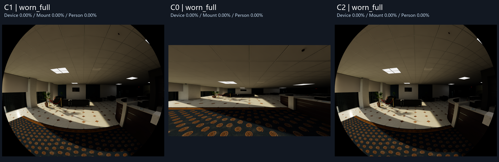
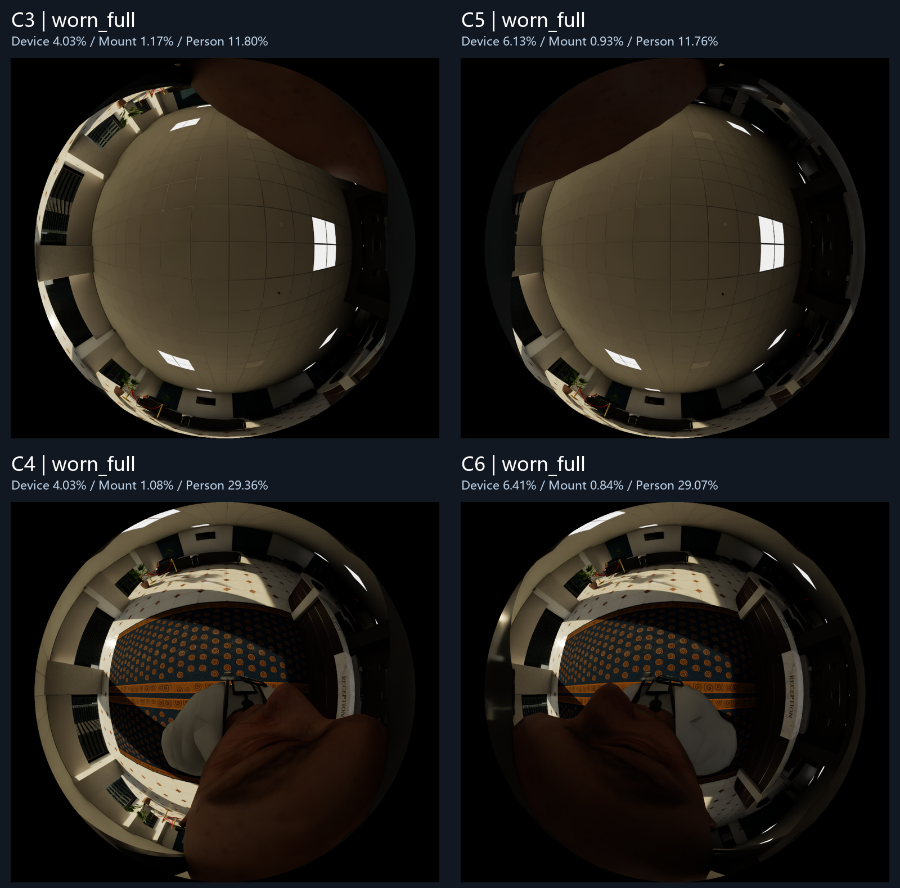
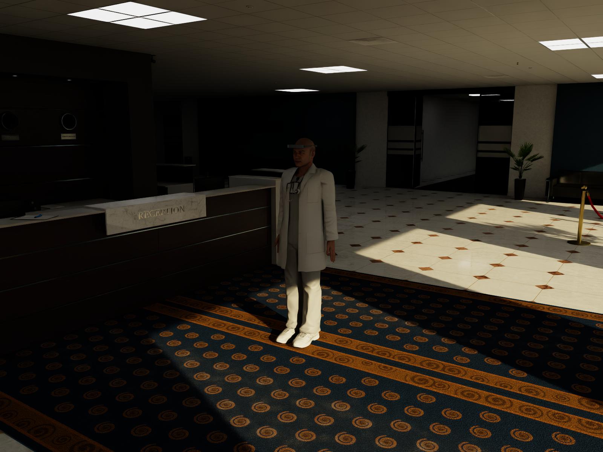
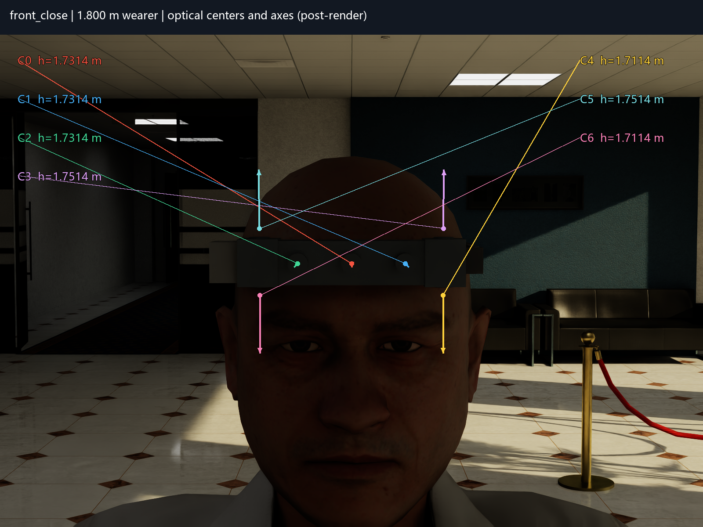
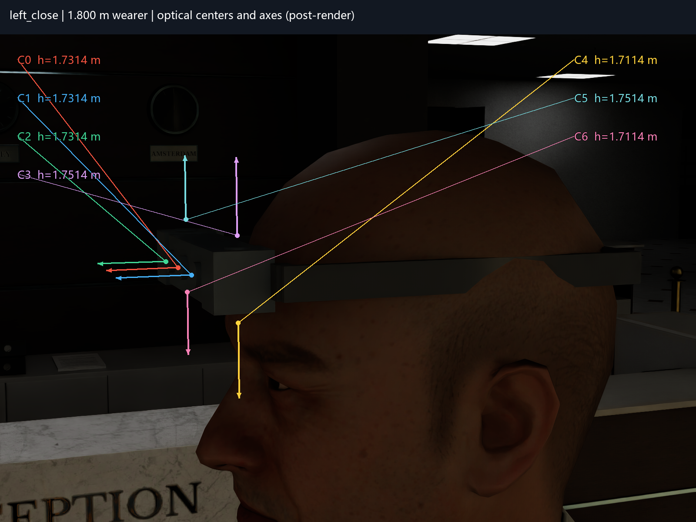
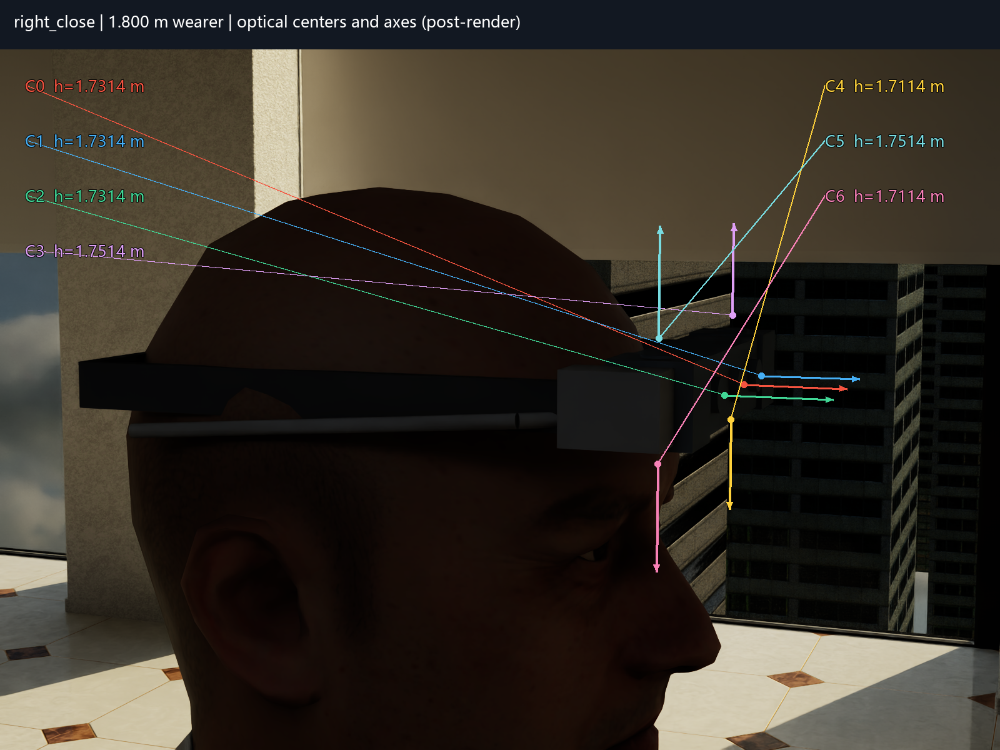

# Step 2.1：官方 Office 中的 1.800 m 人物与七路单目观察





**已完成真实渲染与逐目检查；佩戴适配未通过。** 完整医生人物按最终蒙皮顶点缩放至 1.800 m，双臂下垂、头部平视、鞋底落地。设备按额头表面整体刚体安装，七目方向和内部尺寸保持冻结配置。固定后头带与这个人物头型不匹配：后脑中心截面超出后头带内侧平面约 19–24 mm，侧头带也可见与头皮相交。保留全部几何和冲突截图，未缩放设备或隐藏穿模部件。

前向三目没有设备或人体标签；上视两目主要看到顶板、灯和头皮；下视两目看到地面，同时面部和白大褂明显入镜。人体入镜表示环境视线被人体占用，也可能是第一视角采集所需内容，不能一概解释为设备设计缺陷。









左侧近景最直观地说明头带穿入头皮；[无标注原图](../../outputs/step2_1/overview/left_close_raw.png)保留了完整外观。正面图最适合核对七目属于前额组件，四目没有移到耳侧。彩色点和 35 mm 光轴箭头均为外部图的渲染后投影标注，穿过被遮挡物的标记不代表该镜头表面从观察点可见；前向箭头在正面有透视缩短，请结合侧面检查。标注从未进入正式传感器图。

## 逐相机观察

- **[C0 观察卡](../../outputs/step2_1/camera_cards/C0.png)**：前方可辨认接待台、沙发、立柱、盆栽、地毯与瓷砖，画面上部为顶板和灯。三模式设备/头带/人体标签均为零；无可辨认人体入镜。边缘外观差异来自针孔独立 fx/fy 投影。
- **[C1 观察卡](../../outputs/step2_1/camera_cards/C1.png)**：前方接待区、沙发、窗与百叶、盆栽、瓷砖和地毯；上部天花板弯曲。三模式均无设备、头带或人体标签。黑色角区是成像圆与画幅交集外的 INVALID。
- **[C2 观察卡](../../outputs/step2_1/camera_cards/C2.png)**：前方同一接待区、右侧接待台、沙发、窗、地毯和顶面；与 C1 有固定基线视差，光轴仍平行。三模式均无设备、头带或人体标签；未旋转或镜像。
- **[C3 观察卡](../../outputs/step2_1/camera_cards/C3.png)**：中央为顶板与灯，圆周含墙窗和少量地面；右上侧头皮入镜。设备沿圆周出现，主要为中央壳体；头带位于上缘附近。人体统一标记，不按图像位置伪造部位标签。
- **[C4 观察卡](../../outputs/step2_1/camera_cards/C4.png)**：中央及前半部可见地毯、瓷砖，外圈有墙窗、沙发与顶面。画面下部明显包含面部、白大褂及听诊器；双手和脚未能可靠辨认。壳体在圆周、头带在下缘附近。
- **[C5 观察卡](../../outputs/step2_1/camera_cards/C5.png)**：中央为顶板和灯，周边可见墙窗、接待区与地面；左上侧头皮入镜。中央壳体与右散热件占据部分圆周，头带在上缘附近；右侧设备结构使占比高于 C3。
- **[C6 观察卡](../../outputs/step2_1/camera_cards/C6.png)**：地毯、瓷砖与右侧接待台清晰；下部面部、白大褂和听诊器占据环境视线。圆周设备含中央壳体、右散热件和 USB 线；头带在下缘。双手和脚未能可靠辨认。

观察卡包含该相机 worn_full 原始视角内容、三模式对照、标签叠加、光轴、视场和光心高度。卡内图片仅等比缩小排版；独立文件保持原生分辨率。上视和下视的原始图像上方向不同，未做统一朝向的旋转或镜像，未拼接全景。

## 人物、场景与安装

使用 NVIDIA 官方 Office 和 Male Doctor；资产由既有 Isaac 6.0.1.0 的 `isaacsim.storage.native.get_assets_root_path()` 解析至 `Assets/Isaac/6.0`。Office 无需切换 Hospital，也无需恢复被隐藏的顶面。实际地面为 `/World/Room/SM_FloorCarpetPath_13/SM_CarpetPath_01`，正上方为 `/World/Room/SM_Ceiling_6m16/SM_Ceiling_6m`，均由真实网格射线相交确定。

文档所列 `origial_male_adult_medical_01` 在该根目录返回 404；核实官方 Characters 目录后，实际采用 `original_male_adult_medical_01/male_adult_medical_01.usd`。完整路径、目录证据说明、版本与许可边界见 [asset_sources.md](asset_sources.md)，组合 USD 依赖见 [loaded_layers.json](loaded_layers.json)。未提交官方原始资产和缓存。

人物和 Office 均为 Z-up、metersPerUnit=1；人物朝 -Y，左侧为 +X。医生源资产为 T-pose，没有可用站立动画；仅在本轮覆盖层将左右上臂绕骨架 Y 旋转 +82°/-82°，其余保持原有姿态，双臂下垂且略离开身体。整个人物、衣服和鞋均参与蒙皮求值，静态时间固定为 0。

| 几何量 | 实测值 |
|---|---|
| 姿态调整后、缩放前高度 | 1.788111211 m |
| 人物均匀缩放 | 1.006648797111 |
| 缩放后实际蒙皮高度 | 1.799999967 m |
| 地面 / 鞋底最低点世界 Z | 0.009998464 m |
| 人物头顶世界 Z | 1.809998431 m |
| 正上方顶面世界 Z | 3.000000000 m |
| 额头参考点世界 xyz | (0, -0.059790398, 1.741434156) m |
| C0 / 整机 B 原点世界 xyz | (0, -0.094790398, 1.741434156) m |

高度来自 `UsdSkel.ComputeSkinningTransforms` 与 `ComputeSkinnedPoints` 后的实际顶点极值，含鞋底和头部外轮廓、不含设备；不称为人体测量标准。完整最低/最高顶点坐标和测量过程见 [placement.json](../../outputs/step2_1/placement.json)。站立点 x=y=0，周围 ±0.38 m 站立区域没有相交家具包围盒；全身实图确认人物没有站上桌子或穿入柜台。

额头参考在源人物 z=1.72 m 的截面上取 +Y 射线首次命中的实际头皮表面；该高度低于实测头顶约 68.6 mm。中央壳体背面与该中心参考点相隔 5 mm。设备单独位于 `/World/Rig`，不继承 `/World/Person` 的缩放；仅整机旋转和平移：

```text
R_world_B = [[ 0, 1, 0],
             [-1, 0, 0],
             [ 0, 0, 1]]
t_world_B = [0, -0.094790397826, 1.741434156364] m
scale = 1
```

该变换保持 B 的 X 前、Y 佩戴者左、Z 上。世界空间实测 C1–C2=63 mm，C3–C5/C4–C6=110 mm，C3–C4/C5–C6=40 mm。光心均在实际头皮外，且没有落入冻结设备的实体内部。源 `head_ellipsoid` 与其 Wearer 组在全部模式始终 invisible。

| 相机 / IMU | 离真实地面高度 m | 世界光轴 | 图像上方向 |
|---|---:|---|---|
| C0 | 1.731435693 | -Y | +Z |
| C1 | 1.731435693 | -Y | +Z |
| C2 | 1.731435693 | -Y | +Z |
| C3 | 1.751435693 | +Z | +Y |
| C4 | 1.711435693 | -Z | -Y |
| C5 | 1.751435693 | +Z | +Y |
| C6 | 1.711435693 | -Z | -Y |
| I0 | 1.731435693 | 三轴与 B 平行 | 不适用 |

前向三目全部平视且平行；C3/C5 的图像上方向为 B 的 -X，C4/C6 为 B 的 +X。坐标表中的世界方向来自 USD 实际世界矩阵，浮点数的微小残差已按坐标轴简写。

## 遮挡统计与标签口径

所有比例分母为该相机有效成像像素 N，不包含 INVALID。下表为 worn_full，同一像素只计其渲染器可见类别：

| 相机 | 有效像素 N | 设备 % | 头带/安装件 % | 人体 % | 环境 % | 未知/无命中 % |
|---|---:|---:|---:|---:|---:|---:|
| C0 | 2073600 | 0.0000 | 0.0000 | 0.0000 | 99.3368 | 0.6632 |
| C1 | 1820284 | 0.0000 | 0.0000 | 0.0000 | 95.8980 | 4.1020 |
| C2 | 1820284 | 0.0000 | 0.0000 | 0.0000 | 95.9293 | 4.0707 |
| C3 | 723804 | 4.0300 | 1.1735 | 11.8025 | 78.2449 | 4.7491 |
| C4 | 723804 | 4.0300 | 1.0750 | 29.3628 | 60.9198 | 4.6124 |
| C5 | 723804 | 6.1327 | 0.9293 | 11.7640 | 78.3790 | 2.7951 |
| C6 | 723804 | 6.4135 | 0.8406 | 29.0655 | 60.9117 | 2.7688 |

设备包含外壳、镜筒、散热件和线束；MOUNT 单列头带/安装件；WEARER 是完整人物。C3/C4 的设备贡献主要来自中央壳体；C5/C6 还包含明显的右散热件，C6 的 USB 线有 2,032 个有效像素。逐实例路径、语义回退映射和像素数保存在各图的 `C*_labels.json`；没有用黑色像素或 RGB 差分推断遮挡。

本轮 device_only **含头带**，不同于 Step 2 的 body 口径，不能直接搬用旧统计。对照结果：

| 相机 | 有效像素 N | 设备 % | 头带/安装件 % | 人体 % | 环境 % | 未知/无命中 % |
|---|---:|---:|---:|---:|---:|---:|
| C0 | 2073600 | 0.0000 | 0.0000 | 0.0000 | 99.3368 | 0.6632 |
| C1 | 1820284 | 0.0000 | 0.0000 | 0.0000 | 95.8980 | 4.1020 |
| C2 | 1820284 | 0.0000 | 0.0000 | 0.0000 | 95.9293 | 4.0707 |
| C3 | 723804 | 4.0995 | 3.1037 | 0.0000 | 88.0477 | 4.7491 |
| C4 | 723804 | 4.1687 | 3.1037 | 0.0000 | 88.1152 | 4.6124 |
| C5 | 723804 | 6.1327 | 2.8262 | 0.0000 | 87.5055 | 3.5356 |
| C6 | 723804 | 6.4493 | 2.8262 | 0.0000 | 87.0412 | 3.6833 |

room_only 的设备、头带和人物计数全部为零。全部 21 行计数及比例见 [occlusion_summary.csv](../../outputs/step2_1/occlusion_summary.csv)；[JSON](../../outputs/step2_1/occlusion_summary.json)同时列出 INVALID 数量。三模式没有更换相机位姿、人物姿态、时间或灯光，只切换相应 prim 可见性。人体会挡住部分头带，因此 worn_full 的头带比例可以低于 device_only，不宜把两模式总占比简单相减解释为人体入镜比例。

RGB 与实例标签取自同一次 RenderProduct，均为原生大小。环境按 `/World/Room` 层级及独立语义映射，人物按 `/World/Person`；设备/头带独立映射。散热件的一个实例路径为空，但带有唯一 `step21_device_right_heatsink` 语义，按该语义归类。所有非背景 ID 均有明确映射；当前 UNKNOWN_OR_NO_HIT 是渲染器 BACKGROUND，保持独立列出，未当作 CLEAR 或设备。它可能包含无表面命中、发光/透明等未进入实例标签的像素，本轮未进一步区分。

医生的皮肤网格同时包含头部和手部，服装也不是可靠的人体部位划分，因此只统计整体人物类别。面部/白大褂等文字来自实图观察，不冒充精确身体分割标签。上视圆周中出现少量地面、下视圆周中出现顶面，符合 220° 成像包含越过 90° 的方向，并非相机方向被改错。

## 投影、渲染与局限

- C0：1920×1080，针孔 H120°/V130°，fx=554.256258 px、fy=251.806135 px，独立焦距不变。
- C1/C2：1600×1300，等距 H160°/V130°，有效区是半径 800 px 成像圆与画幅的交集。
- C3–C6：1080×960，等距圆形成像全角 220°，有效圆直径 960 px，fx=fy=250.017947 px。
- 近裁剪保持 0.0001 m，复用已经验证的 Isaac 6.0.1.0 相机后端，保留其 fisheyePolynomial 弃用警告。没有改变投影模型来消除入镜内容。
- 正式 `C*.png` 仅将有效区域外置黑；`C*_raw.png` 保留 RTX 原始输出。原生图未做亮度美化、旋转、镜像或重采样。叠加图只着色设备、头带和人物。
- 保留官方灯光，关闭自动曝光直方图，统一 film ISO=100；未增加补光、未逐相机调曝光。配置的 exposure=0 表示没有额外曝光调整，未声称独立校准物理曝光。人物和深色设备位于阴影中，外部近景反差较低，这是当前图像局限。
- 顶板、地毯、瓷砖、皮肤和服装材质均可辨认；成功运行没有缺失引用/贴图错误，最终待加载资源为 0。日志有无显示器的 GLFW 警告、百叶材质的 MDL 注解/未使用临时量警告及旧鱼眼 API 弃用警告。未将这些警告描述成“零警告加载”。
- 后头带中心线内侧世界 Y=0.115209602 m，实际后脑外表面在采样截面 Y=0.134114–0.138864 m；19–24 mm 指后脑表面超出头带内侧平面的距离，并非全头表面的最小穿透深度。5 mm 厚的后带在这些截面处嵌入头部，不能宣称贴合通过。侧面截图保留交叠轮廓。没有在本轮修改名义头带或安装高度来掩盖问题。

前向中心垂直截面无障碍的地面交点仅作几何核对：h/tan65° = 1.731435693/tan65° = **0.807382 m**（沿相机前向的水平距离）。真实地面可见范围仍以有家具、人体和设备的本轮图像为准。

## 验证与复现

[validation.json](validation.json)检查 21 个相机/模式组合、原生尺寸、有效掩膜与冻结投影、模式间位姿/时间/灯光一致、RGB 与标签配对、计数与分母、63/110/40 mm 尺寸、光心不在设备实体中。505 个冻结文件逐字节未变，包括原件和 Step 1/2 的既有产物；公开克隆仅跳过未公开的私有原件/审阅副本，缺少任何交付结果仍报错。配置 SHA-256：`dfe120ea02244399386dbef1386900813e06f9f5ab87409868eeeddb50bff44d`。

[render_evidence.json](render_evidence.json)记录实际顺序：先 worn_full C0–C6，再 room_only，最后 device_only，之后 4 张外部图。[visual_review.json](visual_review.json)明确分开“数据检查 PASS”与“头带适配 FAIL_INTERSECTION”。成功运行采用异步材质加载；最初同步加载停止推进的任务进程已单独停止，未改其他工程或升级环境。

已实际执行的远端命令（在既有独立工程目录）：

```bash
/root/autodl-tmp/envs/isaacsim-clean/bin/python scripts/start_indoor_job.py --script probe_indoor_assets.py
/root/autodl-tmp/envs/isaacsim-clean/bin/python scripts/start_indoor_job.py --script inspect_indoor_geometry.py
/root/autodl-tmp/envs/isaacsim-clean/bin/python scripts/start_indoor_job.py --script isaac_indoor_wearer.py
```

本地简短入口：

```powershell
# 校验已有结果并生成分组图、叠加图、观察卡
powershell -NoProfile -ExecutionPolicy Bypass -File scripts/run_indoor_wearer.ps1
# 使用既有私有环境配置连接已授权服务器，执行并回传
powershell -NoProfile -ExecutionPolicy Bypass -File scripts/run_indoor_wearer.ps1 -Render
# 打开分组图和原生七路图目录
powershell -NoProfile -ExecutionPolicy Bypass -File scripts/run_indoor_wearer.ps1 -View
# 通过本地文件关联打开覆盖层；应由 Isaac Sim 6.0.1.0 打开
powershell -NoProfile -ExecutionPolicy Bypass -File scripts/run_indoor_wearer.ps1 -OpenScene
```

`-Render` 复用服务器已存在的冻结输入并先检查哈希，密码只交互输入。新服务器需先放入仓库中必要的冻结配置、源码和 rig USD，配置已有 Isaac 环境；本入口不安装系统依赖。`-OpenScene` 依赖本机 USD 文件关联，本轮本机交互式 Isaac GUI 打开标记 **NOT_RUN**；服务器实际打开与渲染该层已经完成。可在 Isaac 的 File > Open 选择 `scenes/step2_1/indoor_wearer.usda`，外部相机位于 `/World/External`，正式相机位于 `/World/Rig/Sensors`。通用 USD 查看器可能不支持现有鱼眼后端。

仅验证静态顺序采集；七路并行 30 FPS、IMU 时序、运动、SLAM/VIO 均 **NOT_RUN**。未开展联合覆盖、共同盲区、相机对重叠体积或布局优化。本轮止于实图与适配问题交付，等待用户看图。
