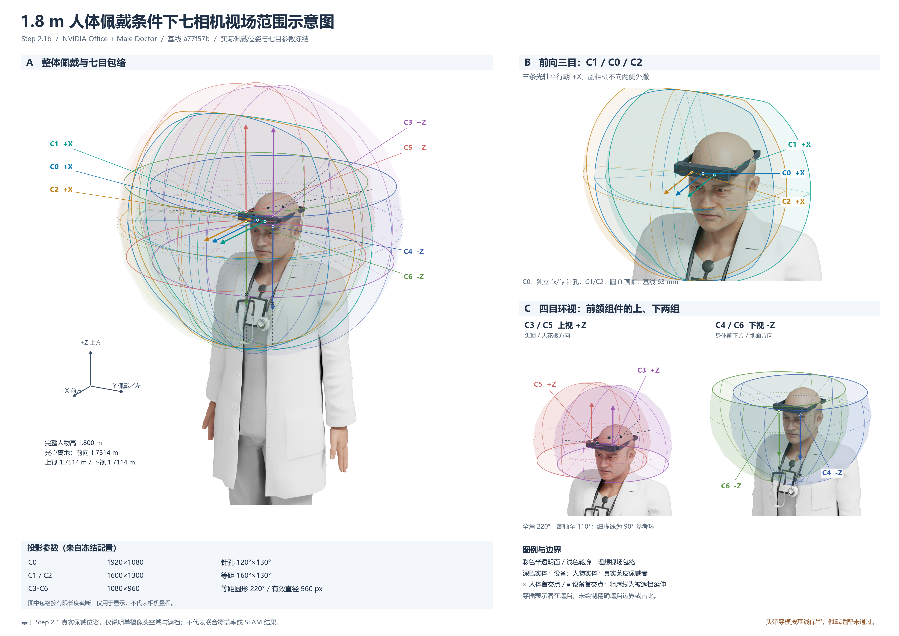

# Step 2.1b 七相机视场技术说明图



交付同一张主图的 [PNG](../../outputs/step2_1b/fov_overview_wearer.png)、[PDF](../../outputs/step2_1b/fov_overview_wearer.pdf) 和 [SVG](../../outputs/step2_1b/fov_overview_wearer.svg)。PNG 为 4800×3400；PDF/SVG 保留矢量包络与文字轮廓/嵌入字体，人物底图为实际 RTX 栅格，不是整张纯矢量模型。

## 基线与实际运行

基于提交 `a77f57b072c2dfcdb791f96a862ef0ddef041d13` 的 `scenes/step2_1/indoor_wearer.usda`，复用 NVIDIA Office、Male Doctor 的静态蒙皮姿态、1.800 m 高度以及 `outputs/step2_1/placement.json` 的整机刚体变换。未混入头带修正或 Step 2.1a 工作。设备仍位于前额，四目仍在左右副相机对应区域的上、下方。

在原有 Isaac Sim 6.0.1.0 GPU 环境实际渲染 4 张外部观察底图：整体、三目局部、上视局部、下视局部。正式七路传感器新增采集为 **0**。新增相机和展示设置仅写入匿名 USD session layer，未保存或改写源场景层。服务器输入按 UTF-8 文本规范化哈希核对；规范化只消除行尾及末尾空行差异，本地原有文件另按原始字节核对。七目实际 USD 世界矩阵与 Step 2.1 placement 数值逐一比较，重新求值的蒙皮高度仍为 1.799999967 m。

为使技术图背景简洁，临时隐藏 Office 背景，并以 dome=650、distant key=1400 的统一说明图照明渲染人物。设备网格在匿名层绑定深灰展示材质，人物保留原资产材质；这些仅影响外部说明图外观，几何、骨骼姿态、设备尺寸、相机位姿和光学均未改变。背景去除蒙版来自同 RenderProduct 实例标签；保留的皮肤、服装、设备外形均为实际场景渲染，不是 AI 图片或重摆模型。

## 三个观察分区

- **A 整体佩戴**：佩戴者左前上方 3/4 观察，上半身、双臂、设备、七个光心和光轴；叠加全部七目浅色包络，并给出 B 坐标系和实际光心高度。
- **B 前向三目**：只绘 C1/C0/C2，全部沿 B 的 +X，三轴严格平行。透视图中箭头允许有极小的透视收敛，不表示相机外撇或会聚。
- **C 四目环视**：上视 C3/C5（+Z）和下视 C4/C6（-Z）分别成子图，避免相反朝向的视场混为一个球。细虚线为 90° 参考环，实线边界到离轴 110°，清楚包含半球以外的部分。

七种颜色对应 C0-C6，并保持跨分区一致。光心点、引线和箭头是准确世界坐标经各外部观察相机投影的渲染后标注；标注不受实体遮蔽，不能据此声称某镜头外表面从观察点直接可见。

## 视场的生成方法

读取冻结 `config/rig_sim_v0.2.json`，通过已有 `camera_specs()` 和 `projection.unproject()` 派生射线；没有另写近似的对称窄锥体。

- C0 使用独立 fx/fy（HFOV=120°、VFOV=130°）的针孔反投影；矩形画幅边界的射线按真实非等焦距关系生成。
- C1/C2 使用等距反投影；以极角扫描连续像平面，半径取矩形边缘与成像圆半径的较小值，故边界是“圆 ∩ 画幅”，不是完整未裁切的圆锥。
- C3-C6 使用直径 960 px 的有效圆边界，等距反投影得到 theta=110°，对应光学 z=cos110°<0；不会丢掉超过 90° 的方向。

每颗相机对边界及内部少量采样环反投影，变换到冻结世界坐标后绘制半透明球面截断包络和稀疏经线。**有限径向显示长度**为 A=0.46 m、B=0.28 m、C 上视=0.27 m、C 下视=0.32 m；仅为排版，既不是相机量程，也不是实测可见距离。因采用径向截断，C0 的远端轮廓是矩形视锥与球面相交的曲线，不是一个平面矩形。各分区观察比例可不同，同一分区内人物、设备和光心使用真实尺度，没有将相机位置拉开。

## 遮挡表达与限制

人物网格先用 `UsdSkel.ComputeSkinningTransforms` / `ComputeSkinnedPoints` 求最终蒙皮顶点；设备使用原有可见 USD 网格。在少量有效方向上计算真实三角形首交点，选取头皮、下视衣服和中央壳体的示例：**× 表示人体首交点，■ 表示设备首交点；其后粗虚线为被遮挡的理想延伸方向**。因此包络不是一律畅通的理想空间。原始示例射线在 `debug/intersection_examples.json`，图中选用数据见 [projection_checks.json](projection_checks.json)。没有输出任何遮挡率或联合覆盖指标。

半透明面、浅色外轮廓和细经线是理想几何说明，允许穿插叠加于人物图像，不是经过精确遮挡裁剪的可见空间实体。外部 2D 合成不做逐面深度消隐；只能结合实际首交点提示理解潜在遮挡，不应用外轮廓面积推断覆盖率。只采样少量三角形射线，不声称得到完整遮挡边界。

保留 Step 2.1 的头带与后脑/侧头皮相交问题；本轮没有修复，也未将佩戴适配改判为通过。NVIDIA 原始 USD、贴图、缓存和蒙皮顶点未发布，只交付引用代码、少量交点证据和渲染底图。完整资产来源沿用 [Step 2.1 来源说明](../step2_1/asset_sources.md)。

## 自检与复现

[validation.json](validation.json) 与 [projection_checks.json](projection_checks.json)记录：

1. 三目和四目分区明确；七目光轴分别为 +X、+Z、-Z，位置属于前额组件。
2. C0/C1/C2 的 H/V 中心截面与冻结 FOV 相符；全部边界反投影/重投影误差低于 1e-8 px；四目边界离轴 110° 且越过 90°。
3. 四张外部图的人物几何、设备和相机位姿与基线一致；旧椭球继续隐藏。
4. 本机 **722 个既有跟踪文件**逐字节未变；正式七路图与 Step 2.1 报告未改写。
5. 主图有相机 ID、坐标系、光轴、参数表、包络与遮挡图例。PNG 和导出 PDF 均进行了可视检查；PDF 为一页，字体正常，未见文字截断或排版溢出。
6. 不进入联合覆盖、布局优化、运动、IMU 或 SLAM。

实际 GPU 入口（在既有独立工程目录）：

```bash
/root/autodl-tmp/envs/isaacsim-clean/bin/python scripts/start_fov_figure_job.py
```

本地复现：

```powershell
# 只用已交付外部底图重建同一张 PNG/PDF/SVG，并校验冻结文件
powershell -NoProfile -ExecutionPolicy Bypass -File scripts/run_fov_figure.ps1
# 在已有已授权 GPU 环境重新渲染 4 张外部图，再排版
powershell -NoProfile -ExecutionPolicy Bypass -File scripts/run_fov_figure.ps1 -Render
# 生成后查看主图
powershell -NoProfile -ExecutionPolicy Bypass -File scripts/run_fov_figure.ps1 -View
```

本地依赖加入 Matplotlib 3.10.9，复用原有 NumPy、Pillow 和 PyMuPDF；没有安装或升级服务器运行环境。PDF 由 Matplotlib 输出并用现有 PyMuPDF 光栅化检查（本机未提供 Poppler）。SVG 的中文文字转为路径以避免其他机器缺字体；PDF 嵌入字体。原始 renderer 日志和 PDF 检查预览仅留本地，公开数据中无连接配置或密码。

本轮完成后停止，等待用户查看主图。
