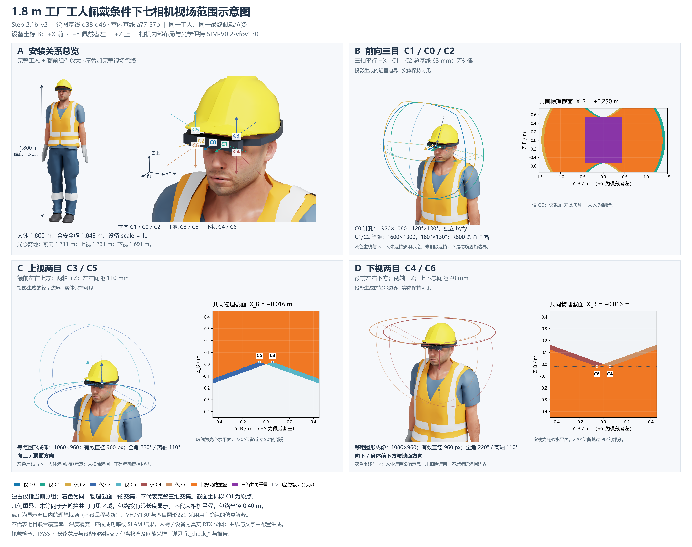

# Step 2.1b-v2：分区视场、工人佩戴与重叠高亮



**佩戴适配：PASS（本轮静态网格检查范围内）。** 工人、头带和全部附件均来自最终场景；人物侧三角面交叉及闭合安全帽实体包含检查未检出冲突。替换头带与冻结设备的布尔交集体积为零，头带为一个连续闭合实体，与壳体贴合连接。允许的贴合接触不计为穿透。

[PNG](../../outputs/step2_1b_v2/fov_overview_wearer_v2.png) · [PDF](../../outputs/step2_1b_v2/fov_overview_wearer_v2.pdf) · [SVG](../../outputs/step2_1b_v2/fov_overview_wearer_v2.svg) · [A/B/C/D 分区](../../outputs/step2_1b_v2/panels/)

## 主要修改与最终状态

- A 仅展示完整工人、额前放大图、七个光心、短光轴及 B 坐标；没有七路完整包络。
- B 单独展示 C1/C0/C2，三轴均平行 +X；C 单独展示 +Z 的 C3/C5；D 单独展示 −Z 的 C4/C6。未移除其他真实镜头、衣物或安全帽几何。
- 重叠采用共同物理截面逐点投影分类，橙色固定表示恰好两路，紫色表示三路；单目独占保留各自颜色。前向截面内“仅 C0”确实为零，图中明确说明。
- 官方工人完整替换医生。按用户追加授权，将背心设为橙黄色、裤子和上衣设为深蓝、帽子设为黄色，手套和鞋为中性深色；皮肤保留官方材质。原始资产不改写，全部材质覆盖保存在本轮 USD。

| 检查项目 | 结果 |
|---|---|
| worker_asset_and_height | PASS |
| wearer_fit | PASS |
| fov_geometry | PASS |
| overlap_visualization | PASS |
| figure_readability | PASS |

最终检查无 FAIL/BLOCKED 项。图像与数值检查分别记录，未把“文件生成成功”当作视觉验收。

## 工人、姿态与身高

实际核实并成功加载的 NVIDIA 官方资产：
[male_adult_construction_01.usd](https://omniverse-content-production.s3-us-west-2.amazonaws.com/Assets/Isaac/6.0/Isaac/People/Characters/original_male_adult_construction_01/male_adult_construction_01.usd)。
`worker_discovery.json` 记录三套候选目录的真实列举、USD 路径、骨架与网格。选择 construction_01，含头颈、躯干、四肢、手套、工作靴、工装和安全帽，共 9 个可见人物网格。

源资产米制、Z-up，正面为 −Y（最终前/侧实渲核对）。仅将双上臂在骨架空间绕 Y 旋转 ±82°至自然下垂；头部和下肢保持静态站姿，不缩小头部。使用 `UsdSkel.ComputeSkinnedPoints` 对最终姿态求实际蒙皮顶点，鞋底最低 Z 至皮肤头顶最高 Z 的源高度为 **1.749004572764 m**；均匀缩放 **1.029156828993**，最终 **1.800000000000 m**。设备独立 scale=1。

安全帽不计入人体头顶身高，但完整参与渲染和碰撞检查。含帽外轮廓总高度 **1.849279765 m**。保留原 NVIDIA Office 环境，技术图仅在临时会话层隐藏背景并调整外部照明。

## 佩戴变换、头带及检查依据

旧医生位姿只用作工人适配起点。旧位姿下，中央壳体、侧舱、上视镜筒、散热件、线束及旧头带与工人/安全帽表面存在相交，详见 `fit_before.json`。因此仅调整头带不足以清除冻结部件冲突。

| 项目 | 调整前 | 最终 |
|---|---|---|
| 整机世界平移 / m | [0.0, -0.09479039782569496, 1.7414341563639621] | [0.0, -0.11479039782569496, 1.7214341563639621] |
| 增量 | — | 世界 [0, −0.020, −0.020] m，即向前 20 mm、向下 20 mm |
| 旋转增量 | — | 0°，B 轴朝向不变 |
| 人体与设备缩放 | 人体独立归一 | 设备始终 1.0 |

这是必要的佩戴配准，不是布局/FOV 优化。相机/IMU 内部坐标、前额壳体、镜筒、散热件和线束形状均未更改。

原左右直带（180×5×16 mm）、后带及左安装块只在本轮覆盖层停用。替换件由真实头部/帽体穿过整个带宽高度的三角形形成保守平面包络，向外偏置 1 mm，带厚 5 mm、高 16 mm，环绕后脑并连接额前组件。随后将额前连接块并入头带，沿冻结壳体做贴合切面，并为散热件、线束切出 0.5 mm 避让槽。布尔结果为一个闭合连通实体，370 顶点、740 三角形，参数和完整替换网格见 `config/step2_1b_v2/refined_mount.json`。不存在只隐藏旧带而不补替代件的处理；旧 head_ellipsoid 保持隐藏。

检查使用实际最终蒙皮、衣物、帽子及设备/头带网格：

1. 所有设备三角面与全部 9 个人物网格做双向线段—三角形测试，另做共面 SAT 接触检测。AABB 仅用于候选加速，不作为通过依据。相对平行阈值 1e−12，坐标焊接/复核容差 1e−8 m，接触报告容差 0.1 mm。
2. 人物顶点对闭合设备实体作包含检查；设备连通分量对闭合安全帽作包含检查。源皮肤和多数衣物是开口网格，因此不对其宣称唯一的封闭体积内部；但它们的所有表面均参与相交检查，未排除任何可见附件。
3. 设备表面按每个三角形不超过 2 mm 的网格边长采样，再计算到候选人物三角面的最近距离。数值是**采样最小间隙**，不是精确连续全局最小距离。头带约 1.00 mm，线束约 2.51 mm；全装配最小采样间隙为 **0.426 mm**（`central_housing`），未把近距离接触误报为穿透。
4. Manifold3D 对闭合新头带与所有冻结硬件求实体交集，全部体积为 0 mm³（容差 0.01 mm³）。中央壳体接口为贴合接触，线束和散热件为避让；不把插入硬件当作“无穿模”。
5. 打开正面、左右、后上方实际渲染检查连续连接、姿态和完整附件。该结论限于本轮静态网格及数值容差，不扩展为压力、舒适度、强度或制造验收。

[正面](../../outputs/step2_1b_v2/fit_check_front.png) · [佩戴者左侧](../../outputs/step2_1b_v2/fit_check_left.png) · [佩戴者右侧](../../outputs/step2_1b_v2/fit_check_right.png) · [后上方](../../outputs/step2_1b_v2/fit_check_toprear.png)

原始渲染保留在 `outputs/step2_1b_v2/debug/`。数值依据为 `fit_before.json`、`fit_after.json`、`independent_fit_check.json`、`mount_connectivity.json`、`mount_hardware_boolean.json`。

## 相机、光学与离地高度

B 原点 C0，+X 前、+Y 佩戴者左、+Z 上。C1—C2 总基线 63 mm；上下组左右距离 110 mm；上下总距离 40 mm。七个内部坐标及 I0(−18,0,0) mm 均通过核对。渲染器从最终 USD 读取七个实际光心、光轴与图像上方向，与同一最终配置一致。

| 分组 | 投影与有效域 |
|---|---|
| C0 | 1920×1080，针孔 120°×130°，独立 fx/fy |
| C1/C2 | 1600×1300，等距 160°×130°，R800 px 成像圆与画幅交集 |
| C3—C6 | 1080×960，等距圆形成像 220°，最大离轴 110°，有效直径 960 px |

VFOV130°是用户确认设置，四目 220°采用用户确认的圆形成像解释，不将其统称为客户 PDF 原文。唯一光学配置 SHA-256：`dfe120ea02244399386dbef1386900813e06f9f5ab87409868eeeddb50bff44d`。

| 光心 | 离地高度 / m |
|---|---:|
| C0 | 1.711435693 |
| C1 | 1.711435693 |
| C2 | 1.711435693 |
| C3 | 1.731435693 |
| C4 | 1.691435693 |
| C5 | 1.731435693 |
| C6 | 1.691435693 |

## 重叠、包络与可读性

对同一世界点 P，分别计算每颗相机自己的 `R_world_optical.T @ (P - origin)`，调用现有 `projection.project` 判断有效画幅/圆域；同时用 B 空间独立表达复核，所有采样点分类一致。不存在外部屏幕多边形求交或透明面自然混色。边界从 `projection.unproject` 生成，每路 192 点往返误差小于 1e−8 px，四目边界全部保持 110°离轴、超过 90°的后半球方向。

| 分区 | 共同物理截面 | 显示窗口 / m | 网格 |
|---|---|---|---|
| B | B 系 X=+0.250，法向 +X，横 Y、纵 Z | Y∈[−1.5,1.5]，Z∈[−0.75,0.75] | 1501×751，2 mm |
| C | B 系 X=−0.016，法向 +X，横 Y、纵 Z | Y、Z∈[−0.45,0.45] | 901×901，1 mm |
| D | 与 C 同一物理平面，使用下视相机 | 同 C | 同 C |

截面只对其显示窗口裁剪，不加相机量程截断。交集仅指该截面，不代表完整三维交集或七目联合覆盖率。“仅某相机”仅指当前组独占。B 区“仅 C0”=0；其余类别均来自实际分类数组，保存在 `debug/section_*.npz`，计数仅用于复核，不作为覆盖率结果。

3D 包络以各自光心为起点、显示半径 0.40 m。**包络按有限长度显示，不代表相机量程。几何重叠，未等同于无遮挡共同可见区域。** 灰色虚线与叉号来自若干实际射线首交点，标注为人体遮挡影响示意，未伪造精确遮挡边界或沿用旧医生遮挡统计。人体、设备不透明；仅绘制少量视场轮廓，重叠着色集中在物理截面。

PNG 为 4800×3800。PDF/SVG 的人物和设备是嵌入的 RTX 位图，截面分类也是位图；曲线和文字为矢量，**不是全部可编辑矢量**。PDF 经过实际栅格化查看，PNG、四分区和四向佩戴图经过目视检查。

## 复现与保护

在已配置的本地虚拟环境和既有 GPU 工程中运行：

```powershell
.\scripts\run_fov_figure_v2.ps1
```

入口只从被忽略的 `config/environment.local.json` 读取连接信息，密码仅在内存；不升级 Isaac、驱动、CUDA 或 ROS。流程为官方资产探测→蒙皮归一与初步适配→应用已保存的精确避让头带及工装配色→独立检查→九张外部渲染→本地截面分类和排版。重现新头带布尔构造可另行运行 `scripts/refine_mount_v2.py`，轻量可选依赖版本列于 `config/step2_1b_v2/requirements_optional.txt`；常规复现直接读取保存的替换网格，不需要在 GPU 环境安装该库。

只重排已有本轮渲染：`.venv\Scripts\python.exe scripts/build_fov_figure_v2.py`。更改几何或配色后应重新运行完整渲染，并重新目视检查，不沿用旧的视觉通过状态。

当前起点 main / d38fd46，a77f57b 是其祖先。744 个既有跟踪文件 SHA-256 保持不变，包含冻结配置、baseline、旧阶段场景/报告/输出。仅更新获授权的 AGENTS 当前阶段说明和新增日志忽略项。官方原始资产、缓存、客户原件、密码及连接配置均不提交。传感器正式帧 0；未开展联合覆盖、布局优化、运动、IMU 或 SLAM。
