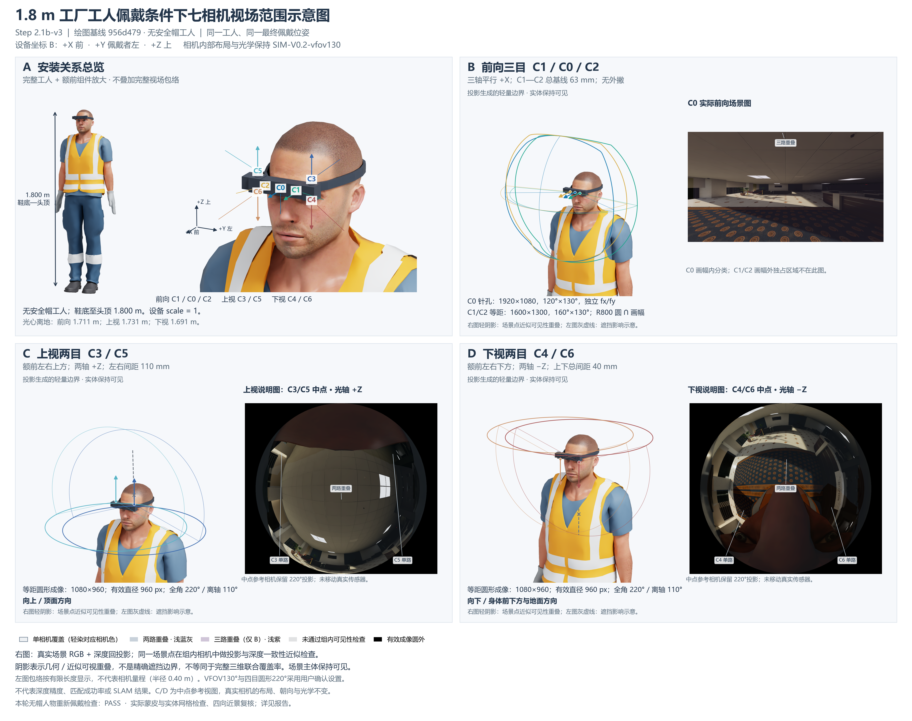

# Step 2.1b-v3：无安全帽工人、相机场景视图与轻量重叠阴影

本轮重新完成无帽人物与最终头带的静态网格检查：**PASS**。A 保留安装总览；B/C/D 右侧取消共同物理截面，改为真实场景 RGB，使视场关系直接对应可辨认的室内、顶面、身体和地面。旧版本全部保留。

[PNG](../../outputs/step2_1b_v3/fov_overview_wearer_v3.png) · [PDF](../../outputs/step2_1b_v3/fov_overview_wearer_v3.pdf) · [SVG](../../outputs/step2_1b_v3/fov_overview_wearer_v3.svg) · [四分区](../../outputs/step2_1b_v3/panels/)

## 人物与最终佩戴

沿用 NVIDIA 官方 [male_adult_construction_01.usd](https://omniverse-content-production.s3-us-west-2.amazonaws.com/Assets/Isaac/6.0/Isaac/People/Characters/original_male_adult_construction_01/male_adult_construction_01.usd)。在新增 USD 覆盖层对唯一 hardhat **网格设置 active=false**；同名材质可能保留，但帽体不参与渲染、蒙皮网格提取或碰撞检查。其余八个人物网格、皮肤、头部尺寸、衣物、手套和靴子保持 v2 几何与自然站姿；仍保留橙黄色背心和深蓝工装，没有删除身体来净化下视画面。官方原始资产未改写。

源鞋底至皮肤头顶高度 1.749004572764 m，全身均匀缩放 1.029156828993；重新用 UsdSkel.ComputeSkinnedPoints 得到最终高度 **1.800000000000 m**。没有单独缩小头部。相比 v2，人物几何仅移除了安全帽。

重新以裸头带宽内实际蒙皮三角面构造保守平面包络，向外留 1 mm，生成高 16 mm、厚 5 mm 的替代头带；连接块并入头带，并沿冻结壳体形成贴合面，为右侧线束留 0.5 mm 避让槽。替换件为 **172 顶点、340 三角形的单一闭合连通实体**，保存于 `config/step2_1b_v3/refined_mount.json`。这是实际替换安装件，不是仅隐藏冲突头带。

整机世界平移保持 `[0.0, -0.11479039782569496, 1.7214341563639621]` m，与 v2 差值 **[0,0,0] m**，旋转差值 **0°**；设备 scale=1。无帽人物下冻结硬件检查已通过，因此无需移动整机。相机/IMU 内部布局、前额壳体、镜筒、散热件和线束形状不变。

### 本轮检查依据

- 新提取最终八个人物网格与全部最终设备网格，重新计算 `fit_before.json`、`fit_after.json`，没有继承 v2 的 PASS。
- 所有设备三角面与所有人物/衣物三角面作双向线段—三角形检查和共面 SAT；相对平行阈值 1e−12、坐标容差 1e−8 m、接触报告容差 0.1 mm。独立复核 `independent_fit_check.json` 未检出相交。
- 人物顶点对闭合设备检查包含；只对闭合人物分量宣称实体包含结论。皮肤及多数服装为开口网格，其全部表面参加检查，但不宣称存在唯一封闭内部。
- 设备表面按不超过 2 mm 的三角形采样间隔测最近人物面距离；全装配最小**采样**间隙 **0.426 mm**（central_housing）。这不是连续全局最小距离保证。
- Manifold3D 3.5.3 检查替代头带与每个冻结硬件实体的交集体积均为零，容差 0.01 mm³。独立连接检查确认只与中央壳体贴合接触，不穿入线束或散热件。
- 正面、左右、后上方实际渲染经过目视检查。结论限于本轮静态网格与数值容差，不等于压力、舒适度、强度或制造验收。

[正面](../../outputs/step2_1b_v3/fit_check_front.png) · [左侧](../../outputs/step2_1b_v3/fit_check_left.png) · [右侧](../../outputs/step2_1b_v3/fit_check_right.png) · [后上方](../../outputs/step2_1b_v3/fit_check_toprear.png)

## B/C/D 场景视角与阴影

| 分区 | 底图 | 参与分类的真实相机 |
|---|---|---|
| B | C0 实际 1920×1080 前向图像，光轴 +X | C0/C1/C2 |
| C | C3/C5 中点参考视图，B 坐标 (−16,0,+20) mm，光轴 +Z，1080×960、220° | C3/C5 |
| D | C4/C6 中点参考视图，B 坐标 (−16,0,−20) mm，光轴 −Z，1080×960、220° | C4/C6 |

两个中点相机仅存在于匿名渲染会话层，不改变七路真实传感器。RGB 与径向深度由同一最终完整场景、同一时刻原生 RTX 相机生成。先完成场景视图，再在匿名层隐藏室内背景、调整灯光与设备展示材质生成外部观察图；这些展示调整不写回传感器或资产。

对参考像素中心调用冻结 `projection.unproject` 得单位射线，以真实 `distance_to_camera` 径向深度回投世界点 P。对每个组内真实相机分别用自己的光心和姿态计算 `R_world_optical.T @ (P-origin)`，经 `projection.project` 检查有效画幅/成像圆，再与该实际相机的径向深度作一致性近似检查：投影邻域 **3×3 像素**最小深度残差不大于 **25 mm + 距离的 0.5%**。由通过检查的相机数与 ID 分类。因此阴影表示同一场景点的组内近似可见性，不是排版画布上的轮廓求交。

仅单路使用对应相机颜色 4% 轻染；两路用蓝灰 14%；三路用浅紫 18%；无组内确认的有限深度点用灰 8%。有效成像圆外保持黑色，缺少有限参考深度的像素不分类；真实身体和硬件遮挡仍保留，不能把所有黑色都解释为成像圆外。只统计像素类别以复核，不输出覆盖率百分比。

B 受 C0 画幅限制，无法展示 C1/C2 在 C0 图像之外的独占方向；“仅 C0”若为零则如实保留。C/D 使用中点参考视图，允许显示各自单路和双路区域。原始 RGB、径向深度、分类标签与阴影图保存在 `outputs/step2_1b_v3/debug/`，`overlap_checks.json` 保存分类与投影往返检查。

`depth_validation.json` 用人物/设备三角面首交距离抽查实际渲染深度；上、下视四颗实际相机及两个参考视角共 205 个近体采样点，最大径向距离差 0.1022 mm，超过 5 mm 的样本为 0；前向三路在该近体采样域没有首交点，未将零样本宣称为深度验证通过。阴影采用有限容差和邻域检查，可能在深度突变、细物体或透明材质附近产生误差，**不是精确遮挡边界、立体匹配可用区、深度精度、配准精度或 SLAM 可靠性结果，也不是完整三维联合覆盖率**。

## 冻结光学、方向与高度

B 原点 C0；+X 前、+Y 佩戴者左、+Z 上。C0/C1/C2 平行朝 +X；C3/C5 朝 +Z；C4/C6 朝 −Z。四目仍位于额前副相机区域上下方，没有移到耳边，也没有单独移动相机。I0=(−18,0,0) mm，三轴与 B 平行。

| 相机 | 投影与有效域 |
|---|---|
| C0 | 1920×1080，针孔 120°×130°，独立 fx/fy |
| C1/C2 | 1600×1300，等距 160°×130°，R800 圆与画幅交集 |
| C3–C6 | 1080×960，220° circular fisheye，有效直径 960 px，最大离轴 110° |

唯一光学配置 SHA-256：`dfe120ea02244399386dbef1386900813e06f9f5ab87409868eeeddb50bff44d`。渲染前核对七个实际 USD 光心、光轴和图像上方向与最终配置一致；边界往返误差 <1e−8 px，四目保持超过 90°的后半球边界。

| 光心 | 离地高度 / m |
|---|---:|
| C0 | 1.711435693 |
| C1 | 1.711435693 |
| C2 | 1.711435693 |
| C3 | 1.731435693 |
| C4 | 1.691435693 |
| C5 | 1.731435693 |
| C6 | 1.691435693 |

左侧包络从各自真实投影边界生成，显示半径 0.40 m 只为排版，不代表量程；灰虚线来自实际人体射线首交的示意。A 不叠加完整大包络。

## 自检与复现

| 自检项 | 结论 |
|---|---|
| 1. 安全帽已移除，渲染与检查一致 | PASS |
| 2. 完整工装工人，身高 1.800 m | PASS |
| 3. A 区简洁清楚 | PASS |
| 4. B/C/D 已取消物理截面图 | PASS |
| 5. B/C/D 使用实际或中点相机场景图 | PASS |
| 6. 采用轻微阴影 | PASS |
| 7. 底图保持可读 | PASS |
| 8. C0/C1/C2 平行 +X | PASS |
| 9. C3/C5 朝 +Z | PASS |
| 10. C4/C6 朝 −Z | PASS |
| 11. 四目仍在副相机区域上下方 | PASS |
| 12. 重新完成无帽人物佩戴检查 | PASS |
| 13. 场景视角较 v2 截面表达更直观（目视判断） | PASS |

PNG 为 4800×3800；PDF/SVG 包含嵌入的 RTX 位图及矢量文字/曲线，不是全矢量。PNG、四分区、四向佩戴图与实际栅格化 PDF 已目视复核，文件哈希记录在 `visual_review.json`。

已配置环境中运行 `.\scripts\run_fov_figure_v3.ps1`。流程为无帽场景与裸头适配→应用保存的精确替代头带→实际九路场景 RGB/深度和九张外部图→独立网格检查→本地重投影与排版；常规重现使用保存的替代网格，无需在 GPU 环境安装 Manifold3D。重新构造布尔网格可在本地取得本轮评估网格缓存后运行 `scripts/refine_mount_v3.py`，本地可选依赖 manifold3d==3.5.3。只重排运行 `scripts/build_fov_figure_v3.py`。几何变化后需重渲染和重新目视验收。

起点为 main / 956d479333a543b43dd546b4744983685f2e4a87。808 个既有跟踪文件哈希均未变化，包含 AGENTS.md、冻结配置和全部旧阶段成果；只新增 v3 文件及日志忽略项。官方原始资产、缓存、客户原件、密码和连接配置不提交。实际生成 7 张技术传感器场景图、2 张中点参考图及 9 张外部图，正式数据集帧为 0；未运行联合覆盖统计、布局优化、运动、IMU 或 SLAM。
