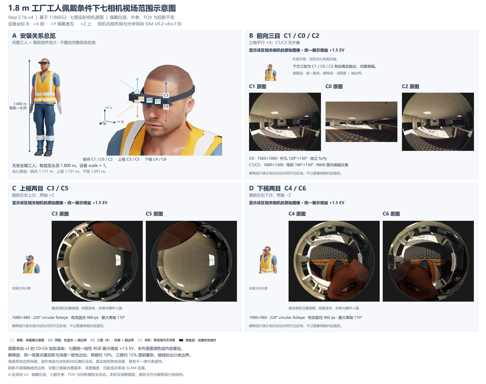

# Step 2.1b-v4 图面收尾

## 修改记录

- A 区版式与内容保持 v3，无帽工人、设备局部、编号和坐标方向不变；导出 A 分区与 v3 **逐像素一致**。
- B 以 C1 / C0 / C2 三张实际原图为主体，保留完整画幅及各自宽高比；小型外部示意只解释朝向。
- C 以 C3 / C5 两张实际上视原图为主体；D 以 C4 / C6 两张实际下视原图为主体。没有以中点参考图替代真实相机图。
- 七张图都明确标注相机 ID 与“原图”；解释层改为轻量阴影与细边界。没有恢复 A 区大包络。

[PNG](../../outputs/step2_1b_v4/fov_overview_wearer_v4.png) · [PDF](../../outputs/step2_1b_v4/fov_overview_wearer_v4.pdf) · [SVG](../../outputs/step2_1b_v4/fov_overview_wearer_v4.svg) · [B/C/D 放大分区](../../outputs/step2_1b_v4/panels/)

## 原图与解释层

输入为提交 1186652946f02437327386856114476a65e5141b 中 `outputs/step2_1b_v3/debug/C0_scene.png` 至 `C6_scene.png` 和对应径向深度。这些都是 v3 已实际执行的 RTX 渲染。本轮不重渲染，不修改场景、人物、佩戴位姿、设备几何、相机外参、FOV 或投影；也不把本轮排版检查说成新一次佩戴仿真。

- `raw/C*.png`：未经修改的原始 PNG，与 v3 文件逐字节一致。
- `display/C*.png`：仅统一展示增益，无解释标注。全部七图采用同一个固定 **+1.5 EV**：按 sRGB 传递函数解码为线性 RGB，乘 2^1.5，裁到 [0,1]，再编码回 sRGB。亮部可能饱和，原始输出保留；不逐图调色、不局部增强、不生成或替换内容，零值黑色仍为零。
- `layers/C*_annotation.png`：独立透明解释图层。两路重叠 alpha=26/255（约 10%），三路 alpha=31/255（约 12%）；单路不着色。无有效深度的像素用稀疏灰斜纹，成像有效域外用暗灰棋盘；这些属于解释层，未改写原图。
- `layers/C*_classification.npz`：相机成员位掩码、相机数量、有效域与未知掩码。`display/C*_annotated.png` 为原图展示层与解释层合成；总图 PDF/SVG 在其上绘制细分类边界和有效域边界。

“原图”在总图中指真实相机输出作为底图，并已明确披露统一增益与解释层，不声称总图像素是未经处理的原始输出。

## 重叠含义与边界

每张相机图分别作为参考，利用该图实际径向深度与冻结投影的单位射线回投同一世界场景点。再按组内各相机自己的光心/旋转重投影，检查画幅与鱼眼有效域，并以 3×3 像素邻域最小深度残差不超过 **25 mm + 距离的 0.5%** 作为近似可见判据。B 使用 C1/C0/C2；C 使用 C3/C5；D 使用 C4/C6。自身可见性和成员位掩码均做一致性校验。

阴影与成员掩码保留逐像素分类。细线分别表示至少两路及三路分类边界；仅对绘线用的标量场作固定 3 px 高斯平滑，减少深度边缘的锯齿密集线，不修改原图、分类或阴影区域，细线位置因此是轻量近似。鱼眼边界与未知掩码独立于图像亮度；真实暗色身体、衣物、设备和阴影仍保留，不能将所有黑色判作遮挡。缺失深度不是遮挡标签。已有 v3 深度抽查记录只读保留，前向三路零近体采样不被误报为完成几何深度抽查。

本图只解释组内近似共同可见场景。邻域容差、深度边缘和透明材质可能带来误差；不等于精确遮挡边界、三维联合覆盖率、匹配成功率、深度精度或 SLAM 可靠性。没有新增覆盖率统计、结构优化或 SLAM 结论。

## 验证与复现

总图 4800×3800；B/C/D 分区以 300 dpi 导出放大图，A 保持 200 dpi 以作逐像素复核。PDF/SVG 含真实场景位图和矢量文字/细线，并非全部矢量。最终 PNG、B/C/D 放大图及 PDF 栅格化页面经过目视检查，未见裁字或重叠排版。视觉复核哈希见 `visual_review.json`。

运行 `.venv\Scripts\python.exe scripts/build_fov_figure_v4.py` 重新生成分类、展示层和图面。该脚本仅读取 v3 数据，写入 v4 目录。更改排版后需重新目视检查，再运行 `scripts/finalize_fov_figure_v4.py`。检查确认旧版跟踪文件全部未变、A 图像逐像素一致、七张原图逐字节一致、七图增益相同、类别成员数一致和单路不着色，结果见 `validation.json`。
